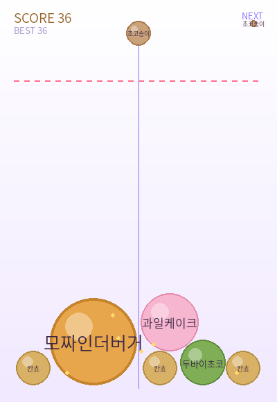

# 뭉냥이의 간식 상자 🍔

치지직/유튜브 스트리머 **뭉냥이**의 비공식 팬 게임. 좋아하는 간식들을 떨어뜨려 같은 것끼리 합치고, 마지막엔 마스코트 **부기(🐢)** 를 만드는 수박게임(머지 퍼즐)입니다.

**pygame**(렌더·입력) + **pymunk**(2D 물리)로 만들었고, 코어 로직은 OOP 디자인 패턴으로 설계해 테스트·확장이 쉽도록 구성했습니다.



---

## 빠른 시작

```bash
# 1) 가상환경
python -m venv .venv
source .venv/bin/activate        # Windows: .venv\Scripts\activate

# 2) 의존성
pip install -r requirements.txt

# 3) 실행
python main.py
```

화면이 없는 서버에서 동작만 확인하려면: `python main.py --smoke`

### 조작
- 마우스를 움직여 위치를 정하고 **버튼을 떼면** 간식이 떨어집니다.
- 같은 간식끼리 닿으면 합쳐집니다. 합치는 순서:
  초코송이 → 칸쵸 → 두바이초코 → 과일케이크 → 파파존스피자 → 모짜인더버거 → 스테이크 → **부기**
- **부기 두 개**를 다시 합치면 펑! +100 보너스.
- 빨간 점선(꽉 참 라인) 위로 간식이 쌓이면 게임오버.

---

## 프로젝트 구조

```
munyang-snackbox/
├── main.py                  # 엔트리 포인트 (--smoke 지원)
├── conftest.py              # 테스트용 import 경로 설정
├── requirements.txt         # 실행 의존성
├── requirements-dev.txt     # 개발/테스트 의존성
├── .vscode/                 # 실행·디버그·테스트 설정
├── assets/                  # (선택) 폰트·효과음·스프라이트
├── docs/                    # 스크린샷 등
├── tests/                   # 헤드리스 로직 테스트
└── src/
    ├── config.py            # 설정 + 단계(TierSpec) 정의
    ├── game.py              # 메인 루프 · 상태 전환 · 시스템 조립
    ├── entities/snack.py    # 간식 엔티티(물리 바디 + 단계)
    ├── factories/           # ── Factory 패턴
    │   └── snack_factory.py
    ├── physics/world.py     # pymunk 래퍼: 벽 · 충돌 · 머지 처리
    ├── events/              # ── Observer 패턴
    │   ├── event_bus.py
    │   └── events.py
    ├── systems/             # 이벤트 구독 시스템들
    │   ├── score.py
    │   ├── particles.py
    │   └── audio.py
    ├── states/              # ── State 패턴
    │   ├── base_state.py
    │   ├── playing_state.py
    │   └── gameover_state.py
    └── ui/renderer.py       # 그리기 전담(로직과 분리)
```

핵심 원칙: **코어 로직(`config·entities·factories·physics·events·systems`)은 pygame을 import 하지 않습니다.** 덕분에 창을 띄우지 않고도 물리·점수·머지 로직을 단위 테스트할 수 있습니다.

---

## 적용한 디자인 패턴

| 패턴 | 위치 | 역할 |
| --- | --- | --- |
| **State** | `src/states/` | `PlayingState` ↔ `GameOverState`. 입력·업데이트·렌더를 상태별로 분리해 `Game`의 조건 분기를 없앰. |
| **Factory** | `src/factories/snack_factory.py` | 단계별 반지름·질량·충돌 속성을 캡슐화. 나머지 코드는 `(tier, x, y)`만 알면 됨. |
| **Observer / Event Bus** | `src/events/`, `src/systems/` | 물리 세계는 `SnackMerged`·`BugiCreated`·`BugiPopped`만 발행. 점수·파티클·오디오가 각자 구독 → 결합도 최소화. |
| **컴포지션 루트** | `Game.__init__` | 하나의 `EventBus`를 공유시키며 시스템을 조립(의존성 주입). |
| **불변 값 객체** | `config.TierSpec` (`frozen dataclass`) | 단계 명세를 불변으로 정의. 파이썬 모듈 자체가 싱글턴이라 별도 Singleton 클래스는 두지 않음. |

> 머지는 충돌 콜백 안에서 즉시 처리하지 않고 **큐에 모았다가 `space.step()` 직후**에 처리합니다. pymunk는 스텝 도중 바디 추가/삭제를 허용하지 않기 때문입니다.

---

## 테스트

```bash
pip install -r requirements-dev.txt
pytest
```

`tests/test_merge.py`는 창 없이(헤드리스) 다음을 검증합니다.
- 같은 단계 간식 두 개가 다음 단계로 합쳐지는지
- 머지 시 `SnackMerged` 이벤트가 발행되는지
- 다른 단계끼리는 합쳐지지 않는지
- `clear()`가 모든 간식을 제거하는지

---

## 확장하기

- **밸런스 조정**: `src/config.py`의 `TIERS`(반지름·색·점수), `DROPPABLE`, `GRAVITY`, `DANGER_Y`만 바꾸면 됨.
- **간식 그림 교체**: `assets/`에 이미지를 넣고 `renderer.draw_snack`에 이미지 분기를 추가.
- **효과음**: `assets/merge.wav`, `assets/bugi.wav`를 넣으면 자동 재생.
- **새 게임 모드**: `BaseState`를 상속한 상태를 추가하고 `Game.change_state`로 전환.

---

## 라이선스 / 고지

코드는 MIT 라이선스(`LICENSE`)입니다. 본 프로젝트는 **비공식 팬 제작물**이며 뭉냥이 및 관련 권리자와 제휴 관계가 없습니다. 캐릭터·브랜드 요소의 권리는 각 권리자에게 있습니다.
